# 🩸 BloodLink – MERN Blood Bank Management System

A production-quality full-stack MERN application that streamlines blood donation, blood requests, inventory management, secure payments, and role-based administration through a centralized digital platform.

Built with scalability, security, clean architecture, and real-world workflows in mind.

---

[](https://react.dev/)
[](https://nodejs.org/)
[](https://www.mongodb.com/)
[](https://tailwindcss.com/)
[](https://www.jwt.io/)
[](https://razorpay.com/)
[](LICENSE)

---

## 📖 Overview

BloodLink is a production-ready Blood Bank Management System designed to simplify the complete blood donation lifecycle through a secure role-based platform.

The application connects **Patients**, **Donors**, **Hospitals**, and **Administrators** into a single centralized ecosystem where blood inventory, donation records, request approvals, secure online payments, and analytics are managed transparently.

Unlike traditional CRUD-based academic projects, BloodLink follows real-world business workflows including approval processes, payment verification, inventory deduction, email notifications, dashboard analytics, and role-specific permissions.

The project was built with an emphasis on clean architecture, maintainability, scalability, responsive UI, and industry-standard development practices.

## 📑 Table of Contents

- [Overview](#-overview)
- [Live Demo](#-live-demo)
- [Highlights](#-highlights)
- [Features](#-features)
- [Tech Stack](#-tech-stack)
- [System Architecture](#-system-architecture)
- [Project Structure](#-project-structure)
- [User Roles](#-user-roles)
- [Authentication Workflow](#-authentication--authorization)
- [Blood Donation Workflow](#-blood-donation-workflow)
- [Blood Request Workflow](#-blood-request-workflow)
- [Payment Workflow](#-payment-workflow)
- [Dashboard Analytics](#-dashboard-analytics)
- [Installation](#-installation)
- [Environment Variables](#-environment-variables)
- [Running the Project](#-running-the-project)
- [Database Seeding](#-database-seeding)
- [Available Scripts](#-available-scripts)
- [API Overview](#-api-overview)
- [Security Features](#-security-features)
- [Project Screenshots](#-project-screenshots)
- [Testing](#-testing)
- [Performance Optimizations](#-performance-optimizations)
- [Production Ready Features](#-production-ready-features)
- [Future Enhancements](#-future-enhancements)
- [Deployment](#-deployment)
- [Why BloodLink?](#-why-bloodlink)
- [Contributing](#-contributing)
- [License](#-license)
- [Author](#-author)
- [Acknowledgements](#-acknowledgements)

---

## 🌐 Live Demo

### Frontend Dependencies

> Add your deployed frontend URL here

```text
Coming Soon
```

### Backend API

> Add your deployed backend URL here

```text
Coming Soon
```

---

## ✨ Highlights

- 🔐 JWT Authentication with Refresh Tokens
- 👥 Multi-Role Access Control
- 🩸 Blood Donation Management
- 📦 Central Blood Inventory
- 📋 Blood Request Workflow
- 💳 Razorpay Payment Integration
- 📧 Email Notifications
- 📊 Dashboard Analytics
- 🌙 Dark / Light Theme
- 📱 Fully Responsive Design
- ⚡ Modern React Architecture
- 🛡️ Secure Backend Validation
- 🚀 Production Ready

---

## 🚀 Features

## Authentication Screenshots

- User Registration
- Secure Login
- Logout
- JWT Authentication
- Refresh Token Authentication
- Forgot Password
- Reset Password
- Protected Routes
- Role-Based Authorization

---

## User Management

- Profile Management
- Update Profile
- Admin Approval Workflow
- Pending User Management
- User Search
- Pagination
- Role Filtering

---

## Blood Donation

- Record Blood Donations
- Donation History
- 90-Day Donor Cooldown
- Hospital Blood Donations
- Automatic Inventory Updates
- Blood Group Validation

---

## Blood Requests

- Create Blood Requests
- Patient Request Validation
- Hospital Request Validation
- Admin Approval
- Request Rejection
- Dynamic Processing Fee (₹500 per Blood Unit)
- Razorpay Payment
- Automatic Inventory Deduction
- Request History

---

## Inventory

- Central Blood Inventory
- Blood Group Distribution
- Live Blood Stock
- Low Stock Detection
- Inventory Summary
- Automatic Quantity Updates

---

## Dashboard & Analytics

- System Overview
- User Statistics
- Donation Statistics
- Request Statistics
- Revenue Analytics
- Blood Units Delivered
- Blood Group Distribution
- Low Stock Monitoring
- Recent Donations

---

## User Experience

- Responsive Layout
- Sidebar Navigation
- Dark / Light Theme
- Skeleton Loaders
- Empty States
- Confirmation Dialogs
- Toast Notifications
- Animated Components
- Clean Dashboard UI

---

## 🛠 Tech Stack

## Frontend

- React 19
- Vite
- React Router DOM
- Tailwind CSS
- Axios
- React Hook Form
- React Hot Toast
- Framer Motion
- Recharts
- Lucide React

---

## Backend Scripts

- Node.js
- Express.js
- MongoDB Atlas
- Mongoose
- JWT Authentication
- Zod Validation
- Razorpay
- Nodemailer (Brevo SMTP)

---

## Development Tools

- Git
- GitHub
- VS Code
- ESLint
- Prettier
- Postman

---

## 🏗️ System Architecture

```text
                    ┌───────────────────────────┐
                    │        React (Vite)       │
                    │     Tailwind CSS UI       │
                    └─────────────┬─────────────┘
                                  │
                          REST API (Axios)
                                  │
                    ┌─────────────▼─────────────┐
                    │      Express.js API       │
                    │ Authentication & Business │
                    │         Logic Layer       │
                    └─────────────┬─────────────┘
                                  │
                  ┌───────────────┼────────────────┐
                  │               │                │
                  ▼               ▼                ▼
             MongoDB Atlas    Razorpay       Brevo SMTP
              Database        Payments          Emails
```

BloodLink follows a modular MVC architecture where the frontend communicates with the backend through REST APIs. The backend manages authentication, authorization, validation, business rules, payment verification, inventory management, and email notifications before persisting data into MongoDB.

---

## 📂 Project Structure

```text
BloodLink/
│
├── client/
│   ├── public/
│   ├── src/
│   │   ├── assets/
│   │   ├── components/
│   │   ├── constants/
│   │   ├── contexts/
│   │   ├── features/
│   │   ├── hooks/
│   │   ├── layouts/
│   │   ├── pages/
│   │   ├── providers/
│   │   ├── services/
│   │   ├── styles/
│   │   └── utils/
│   │
│   └── package.json
│
├── server/
│   ├── src/
│   │   ├── config/
│   │   ├── constants/
│   │   ├── controllers/
│   │   ├── database/
│   │   ├── middleware/
│   │   ├── models/
│   │   ├── routes/
│   │   ├── scripts/
│   │   ├── seed/
│   │   ├── templates/
│   │   ├── utils/
│   │   └── validations/
│   │
│   └── package.json
│
├── docs/
├── screenshots/
├── LICENSE
└── README.md
```

---

## 👥 User Roles

BloodLink supports four different user roles, each with dedicated permissions.

| Role | Permissions |
| ------ | ------------- |
| **Admin** | Approve users, manage requests, monitor inventory, dashboard analytics |
| **Donor** | Donate blood, view donation information, manage profile |
| **Patient** | Request blood matching their registered blood group, complete payment, view request history |
| **Hospital** | Donate blood inventory, request multiple blood units, manage hospital requests |

---

## 🔐 Authentication & Authorization

The application implements secure authentication using JWT-based access control.

### Authentication Features

- User Registration
- Secure Login
- Logout
- JWT Access Token
- Refresh Token
- Forgot Password
- Reset Password
- Protected Routes
- Role-Based Authorization

### Approval Workflow

```text
Register
      │
      ▼
Patient ───────────────► Active Account

Donor / Hospital
      │
      ▼
Pending Approval
      │
      ▼
Admin Review
      │
 ┌────┴────┐
 │         │
 ▼         ▼
Approved  Rejected
 │
 ▼
Active Account
```

Patients receive immediate access after registration, while donor and hospital accounts require administrator approval before they can access the system.

---

## 🩸 Blood Donation Workflow

```text
Donor / Hospital
        │
        ▼
Submit Donation
        │
        ▼
Validate Blood Group
        │
        ▼
Donation Recorded
        │
        ▼
Inventory Updated
```

### Blood Request Business Rules

- Donors can donate **1 blood unit** per donation.
- Donors must wait **90 days** before donating again.
- Hospitals can donate **1–10 blood units** in a single donation.
- Inventory is updated immediately after a successful donation.

---

## 📋 Blood Request Workflow

```text
Create Request
      │
      ▼
Pending
      │
      ▼
Admin Approval
      │
      ▼
Payment Pending
      │
      ▼
Razorpay Payment
      │
      ▼
Payment Verification
      │
      ▼
Inventory Deduction
      │
      ▼
Request Completed
```

### Business Rules

- Patients can request only their registered blood group.
- Patients can request up to **2 blood units**.
- Hospitals can request up to **5 blood units**.
- Processing charges are calculated dynamically at **₹500 per blood unit**.
- Inventory is deducted **only after successful payment verification**.

---

## 💳 Payment Workflow

BloodLink integrates Razorpay Test Mode for secure payment processing.

```text
Approved Request
        │
        ▼
Create Razorpay Order
        │
        ▼
Complete Payment
        │
        ▼
Verify Signature
        │
        ▼
Update Payment Status
        │
        ▼
Deduct Inventory
        │
        ▼
Send Confirmation Email
```

### Payment Features

- Dynamic pricing based on requested blood units
- Secure Razorpay signature verification
- Automatic payment status updates
- Automatic inventory deduction
- Email confirmation after successful payment

---

## 📊 Dashboard Analytics

The administrator dashboard provides real-time operational insights.

### Available Metrics

- Total Users
- Total Donors
- Total Patients
- Total Hospitals
- Pending Approvals
- Completed Requests
- Revenue Generated
- Blood Units Delivered
- Blood Inventory Summary
- Blood Group Distribution
- Low Stock Alerts
- Recent Donations

These analytics help administrators monitor the overall health of the blood management system from a single dashboard.

---

## ⚙️ Installation

Follow the steps below to set up BloodLink on your local machine.

## 1. Clone the Repository

```bash
git clone https://github.com/Bhargav3905/BloodLink.git

cd BloodLink
```

---

## 2. Install Dependencies

### Server Dependencies

```bash
cd server

npm install
```

### Client Dependencies

```bash
cd ../client

npm install
```

---

## 🔑 Environment Variables

## Backend (.env)

Create a `.env` file inside the **server** directory.

```env
PORT=8000

MONGODB_URI=your_mongodb_connection_string

DB_NAME=bloodlink

CLIENT_URL=http://localhost:5173

ACCESS_TOKEN_SECRET=your_access_token_secret
ACCESS_TOKEN_EXPIRY=15m

REFRESH_TOKEN_SECRET=your_refresh_token_secret
REFRESH_TOKEN_EXPIRY=7d

RESET_TOKEN_SECRET=your_reset_token_secret
RESET_TOKEN_EXPIRY=15m

PROCESSING_FEE_PER_UNIT=500

LOW_STOCK_THRESHOLD=5

RAZORPAY_KEY_ID=your_razorpay_key_id
RAZORPAY_KEY_SECRET=your_razorpay_key_secret

EMAIL_HOST=smtp-relay.brevo.com
EMAIL_PORT=587
EMAIL_USER=your_brevo_login
EMAIL_PASS=your_brevo_password

ADMIN_NAME=Admin
ADMIN_EMAIL=admin@example.com
ADMIN_PASSWORD=your_secure_password
ADMIN_PHONE=9999999999
ADMIN_CITY=Ahmedabad
ADMIN_BLOOD_GROUP=O+
```

---

## Frontend (.env)

Create a `.env` file inside the **client** directory.

```env
VITE_API_BASE_URL=http://localhost:8000/api/v1
VITE_RAZORPAY_KEY_ID=your_razorpay_key_id
```

---

## ▶️ Running the Project

## Start Backend

```bash
cd server

npm run dev
```

Backend runs on:

```text
http://localhost:8000
```

---

## Start Frontend

```bash
cd client

npm run dev
```

Frontend runs on:

```text
http://localhost:5173
```

---

## 🌱 Database Seeding

To create the default administrator account and initialize blood inventory, run:

```bash
cd server

npm run seed
```

This command:

- Creates the default administrator account.
- Initializes blood inventory for all supported blood groups.
- Prevents duplicate seed data on subsequent executions.

---

## 📜 Available Scripts

## Backend

| Command | Description |
| ---------- | ------------- |
| `npm run dev` | Start development server |
| `npm start` | Start production server |
| `npm run seed` | Seed admin account and inventory |

---

## Frontend Scripts

| Command | Description |
| ---------- | ------------- |
| `npm run dev` | Start Vite development server |
| `npm run build` | Create production build |
| `npm run preview` | Preview production build |
| `npm run lint` | Run ESLint |

---

## 🔌 API Overview

## Authentication Endpoints

| Method | Endpoint |
| --------- | ---------- |
| POST | `/api/v1/auth/register` |
| POST | `/api/v1/auth/login` |
| POST | `/api/v1/auth/logout` |
| POST | `/api/v1/auth/refresh-token` |
| POST | `/api/v1/auth/forgot-password` |
| POST | `/api/v1/auth/reset-password/:token` |

---

## Users

| Method | Endpoint |
| --------- | ---------- |
| GET | `/api/v1/users/profile` |
| PATCH | `/api/v1/users/profile` |
| GET | `/api/v1/users/pending` |
| PATCH | `/api/v1/users/:id/approve` |
| PATCH | `/api/v1/users/:id/reject` |

---

## Donations

| Method | Endpoint |
| --------- | ---------- |
| POST | `/api/v1/donations` |
| GET | `/api/v1/donations/history` |

---

## Blood Requests Screenshot

| Method | Endpoint |
| --------- | ---------- |
| POST | `/api/v1/requests` |
| GET | `/api/v1/requests/my` |
| GET | `/api/v1/requests/pending` |
| PATCH | `/api/v1/requests/:id/approve` |
| PATCH | `/api/v1/requests/:id/reject` |

---

## Payments

| Method | Endpoint |
| --------- | ---------- |
| POST | `/api/v1/payments/create-order/:requestId` |
| POST | `/api/v1/payments/verify` |

---

## Analytics

| Method | Endpoint |
| --------- | ---------- |
| GET | `/api/v1/analytics/overview` |
| GET | `/api/v1/analytics/inventory-summary` |
| GET | `/api/v1/analytics/request-statistics` |
| GET | `/api/v1/analytics/blood-distribution` |
| GET | `/api/v1/analytics/low-stock` |
| GET | `/api/v1/analytics/donation-statistics` |

---

## 🛡 Security Features

- JWT Access & Refresh Token Authentication
- Secure Password Hashing with bcrypt
- Role-Based Authorization
- Protected API Routes
- Request Validation using Zod
- Secure Razorpay Signature Verification
- Environment Variable Configuration
- Input Validation
- Centralized Error Handling
- Secure Email-Based Password Reset

---

## 📸 Project Screenshots

The following screenshots showcase the major features and workflows of BloodLink.

---

## 🏠 Landing Page

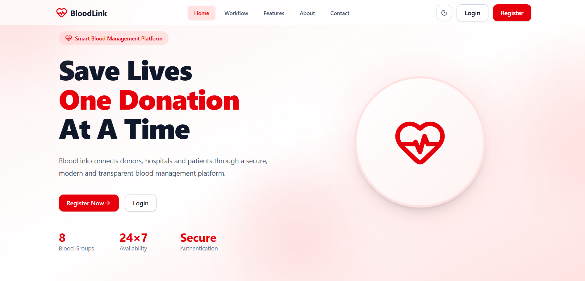

---

## ✨ Features Section

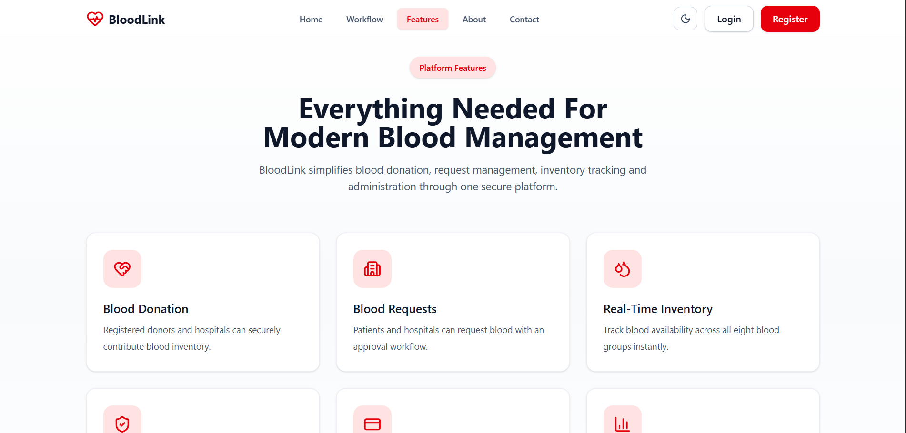

---

## 🔐 Authentication

### Login

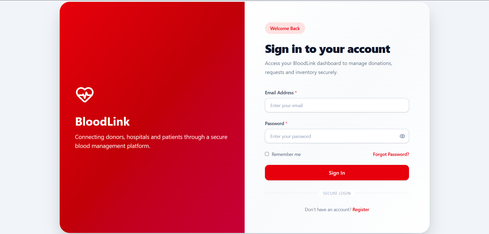

### Register

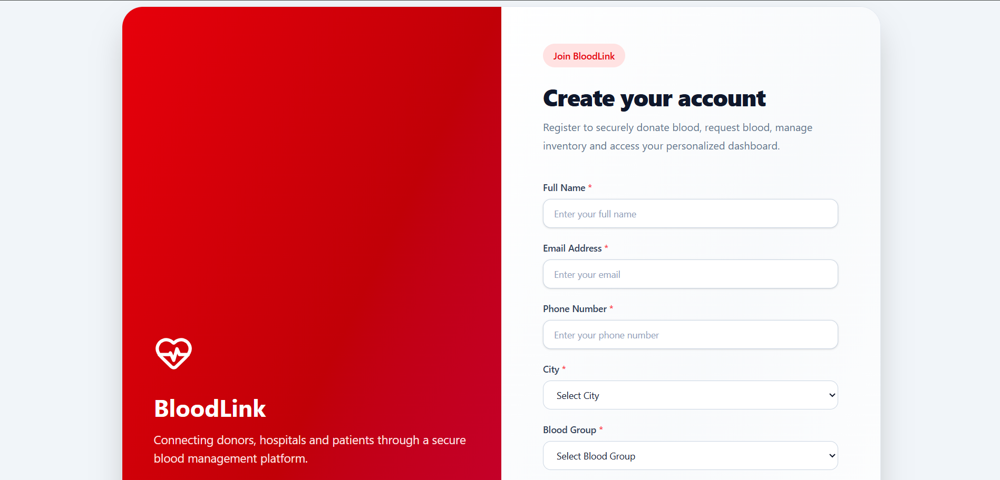

### Forgot Password

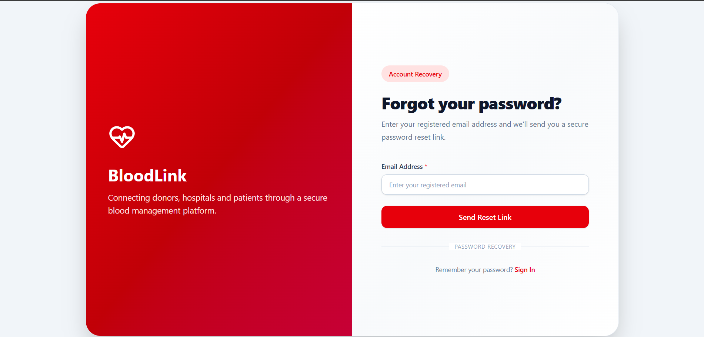

---

## 👨‍💼 Admin Dashboard

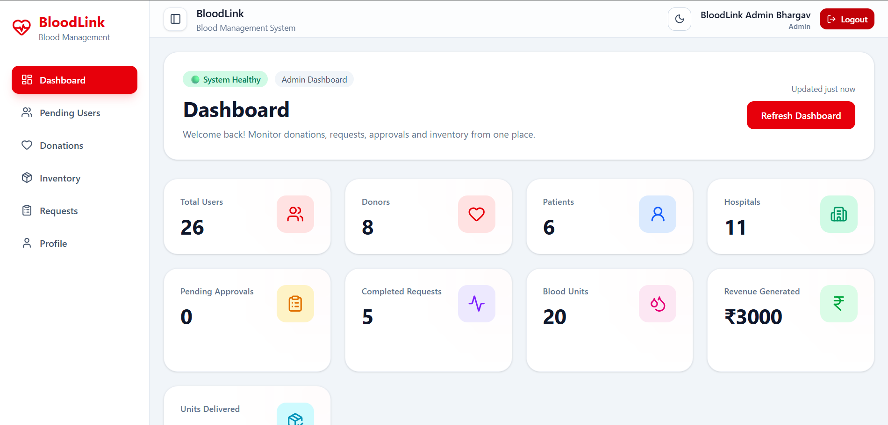

---

## 👥 User Management

Approve or reject donor and hospital registrations.

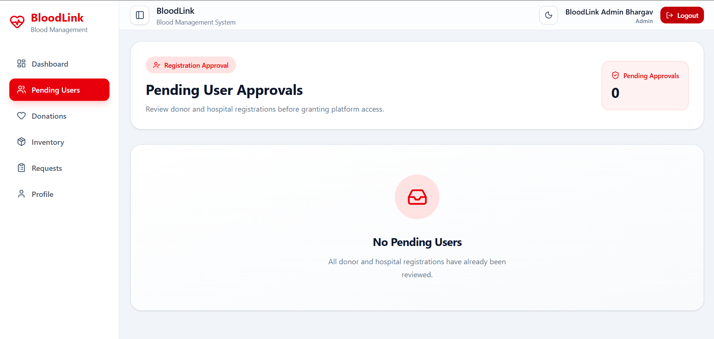

---

## ⏳ Pending Blood Requests

Approve or reject blood requests submitted by patients and hospitals.

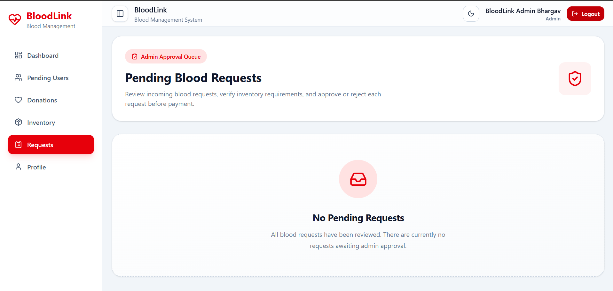

---

## 🩸 Blood Inventory

Monitor available blood units across all blood groups.

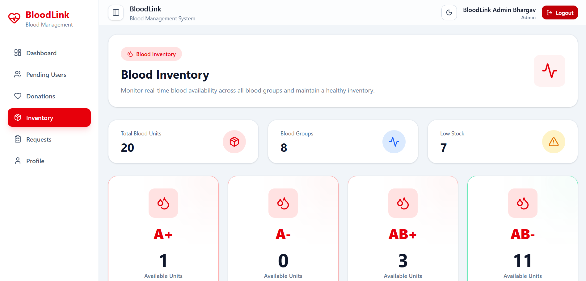

---

## ❤️ Donation History

Track every blood donation recorded in the system.

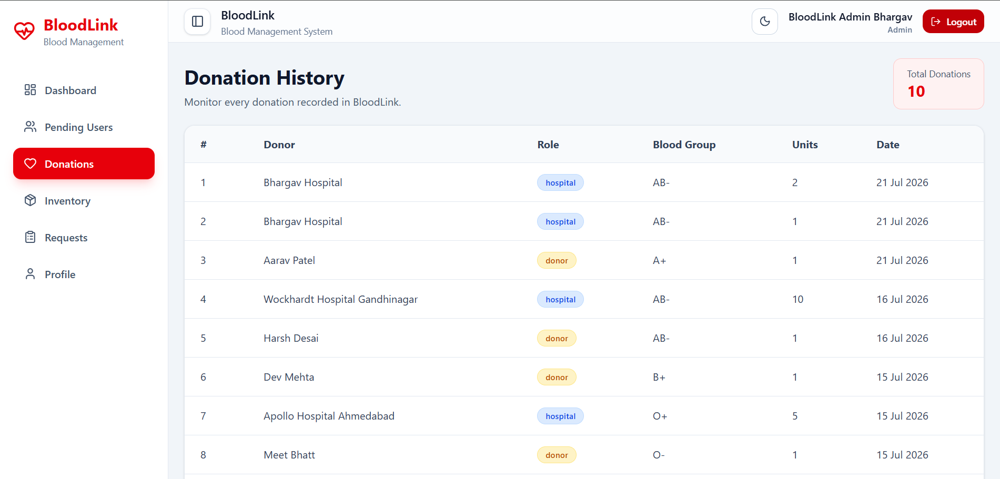

---

## 🧑 Donor Dashboard

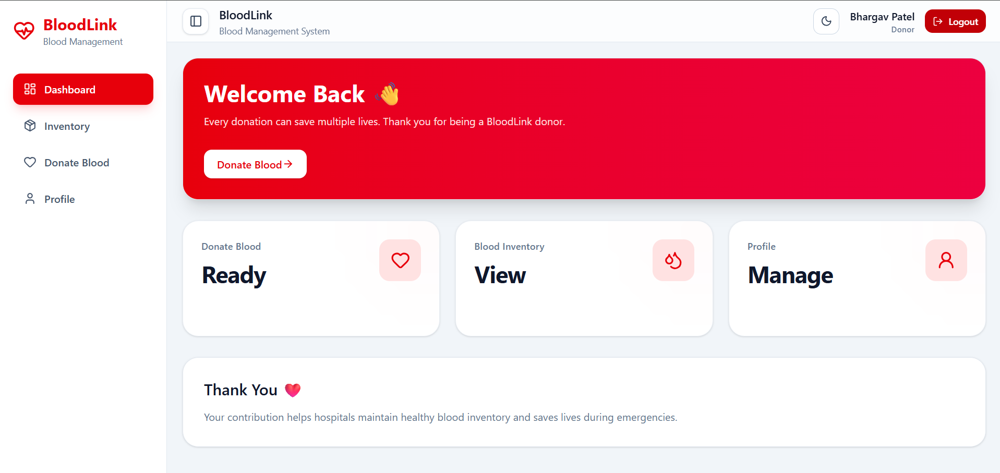

---

## 🩸 Donor – Donate Blood

Record a new blood donation with cooldown validation.

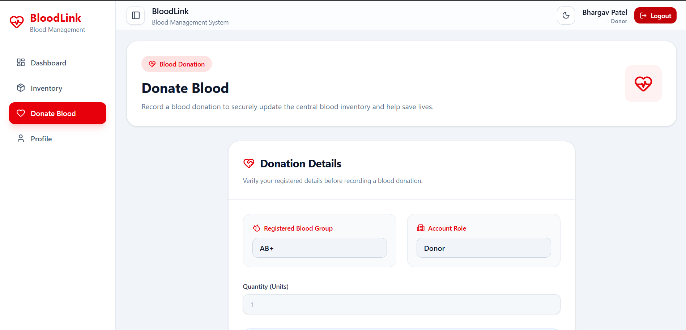

---

## 🏥 Patient Dashboard

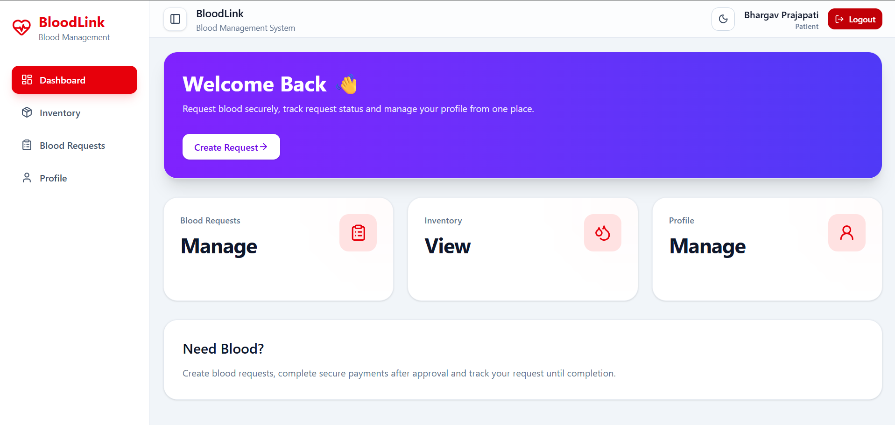

---

## 📝 Patient – Create Blood Request

Dynamic request form with real-time processing fee calculation.

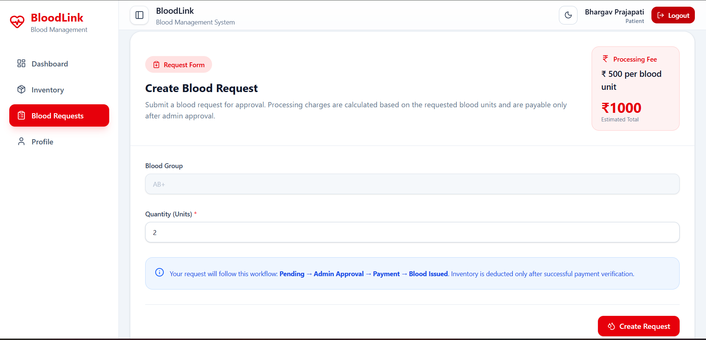

---

## 📋 Patient – My Requests

Track request status and complete payment after approval.

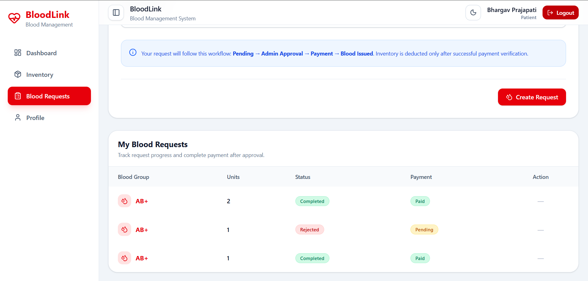

---

## 🏥 Hospital Dashboard

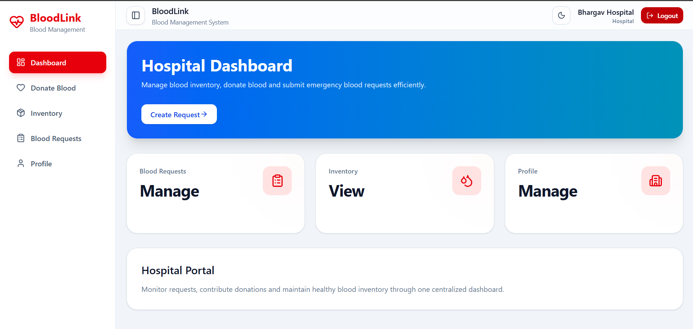

---

## ❤️ Hospital – Donate Blood

Hospital blood donation workflow.

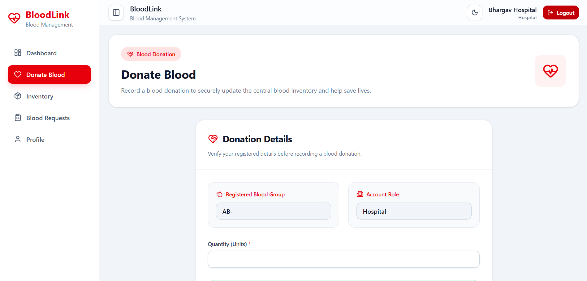

---

## 🩸 Hospital – Create Blood Request

Hospital request workflow with dynamic pricing.

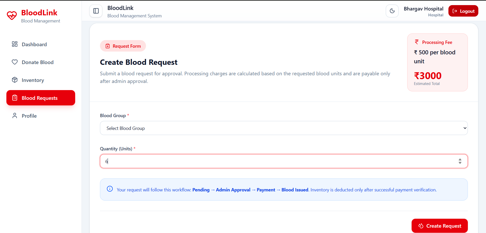

---

## 💳 Razorpay Payment

Secure payment flow after administrator approval.

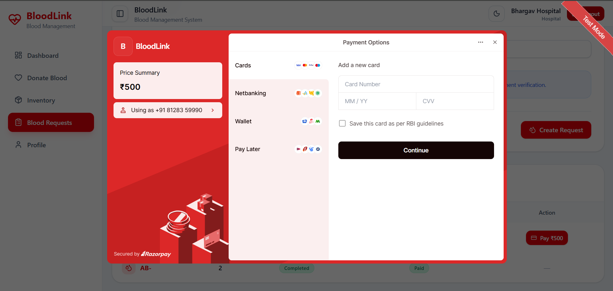

---

## 👤 User Profile

Manage personal information and account details.

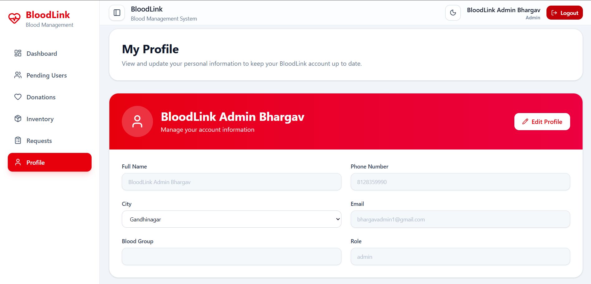

---

## 🌙 Dark Mode

Fully responsive interface with complete Light and Dark theme support.

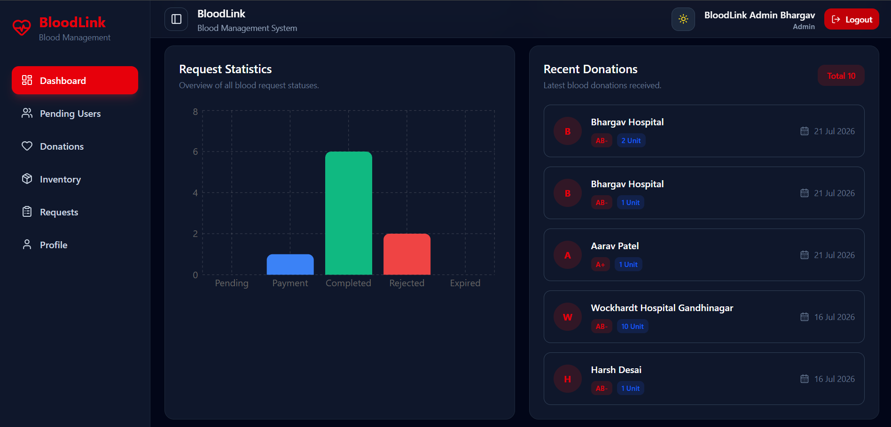

---

## 🧪 Testing

The application was manually tested across all supported user roles to ensure correctness of authentication, authorization, workflows, payment processing, and UI responsiveness.

### Guest

- Landing Page
- Navigation
- Theme Toggle
- Register
- Login
- Forgot Password
- Reset Password
- Protected Routes

---

### Admin

- Dashboard
- Pending User Approval
- User Rejection
- Pending Blood Requests
- Request Approval
- Request Rejection
- Inventory Dashboard
- Donation History
- Analytics Dashboard
- Revenue Analytics
- Sidebar Navigation
- Theme Switching

---

### Donor

- Blood Donation
- Donation Cooldown Validation
- Profile Management
- Dashboard
- Theme Support

---

### Patient

- Blood Request Creation
- Blood Group Validation
- Dynamic Pricing
- Razorpay Payment
- Request History
- Profile Management

---

### Hospital

- Multi-unit Blood Donation
- Multi-unit Blood Requests
- Dynamic Pricing
- Razorpay Payment
- Request History
- Profile Management

---

## ⚡ Performance Optimizations

- Modular Feature-Based Architecture
- Reusable UI Components
- Lazy API Loading
- Axios Service Layer
- React Hook Form Validation
- Optimized MongoDB Queries
- Parallel Database Queries using `Promise.all()`
- Centralized Error Handling
- Environment Variable Configuration
- Responsive UI with Tailwind CSS

---

## 🚀 Production Ready Features

✔ JWT Authentication

✔ Refresh Token Authentication

✔ Role-Based Authorization

✔ Approval Workflow

✔ Password Reset via Email

✔ Dynamic Processing Fee

✔ Razorpay Payment Integration

✔ Revenue Analytics

✔ Blood Inventory Management

✔ Low Stock Detection

✔ Email Notifications

✔ Responsive Design

✔ Dark / Light Theme

✔ Skeleton Loaders

✔ Empty States

✔ Confirmation Dialogs

✔ Toast Notifications

✔ Form Validation

✔ Protected Routes

✔ Modular Folder Structure

✔ Clean Code Architecture

---

## 🌱 Future Enhancements

Although BloodLink is production-ready, the following improvements can be considered for future versions:

- Blood Donation Appointment Scheduling
- Nearby Blood Bank Locator
- Emergency Blood Request Notifications
- PDF Receipt Generation
- Blood Compatibility Recommendation
- Real-Time Notifications
- Admin Activity Logs
- Audit Trail
- Docker Support
- CI/CD Pipeline
- Unit & Integration Testing
- Multi-language Support

---

## 🌍 Deployment

The application can be deployed using the following services:

| Service | Purpose |
| --------- | ---------- |
| Vercel | Frontend Deployment |
| Render | Backend Deployment |
| MongoDB Atlas | Cloud Database |
| Razorpay | Payment Gateway |
| Brevo SMTP | Email Service |

---

## 💼 Why BloodLink?

BloodLink was built as a production-quality portfolio project to demonstrate real-world full-stack software engineering practices beyond basic CRUD applications.

The project focuses on secure authentication, role-based access control, modular architecture, payment processing, analytics, inventory management, and scalable code organization while delivering a responsive and modern user experience.

It reflects industry-standard development practices suitable for internships, placements, and full-stack developer portfolios.

---

## 🤝 Contributing

Contributions, feature suggestions, and bug reports are always welcome.

If you'd like to contribute:

1. Fork the repository.
2. Create a new feature branch.

```bash
git checkout -b feature/your-feature-name
```

3.Commit your changes.

```bash
git commit -m "feat: add new feature"
```

4.Push your branch.

```bash
git push origin feature/your-feature-name
```

5.Open a Pull Request.

Please ensure that your code follows the existing project structure, coding standards, and naming conventions.

---

## 📝 License

This project is licensed under the **MIT License**.

See the [LICENSE](LICENSE) file for more details.

---

## 👨‍💻 Author

### Bhargav K. Prajapati

B.Tech Information & Communication Technology

Pandit Deendayal Energy University (PDEU)

Full Stack MERN Developer

---

### Connect with Me

> Replace these with your own links.

- GitHub: [https://github.com/Bhargav3905](https://github.com/Bhargav3905)
- LinkedIn: [https://www.linkedin.com/in/bhargavprajapati1309](https://www.linkedin.com/in/bhargavprajapati1309)
- Portfolio: [https://bhargavprajapti.lovable.app](https://bhargavprajapti.lovable.app)
- Email: [prajapatibhargavk@gmail.com](mailto:prajapatibhargavk@gmail.com)

---

## 🙏 Acknowledgements

Special thanks to the open-source community and the technologies that made this project possible.

- React
- Vite
- Tailwind CSS
- Node.js
- Express.js
- MongoDB Atlas
- Mongoose
- Razorpay
- Brevo SMTP
- React Hook Form
- Recharts
- Lucide React
- React Hot Toast
- Framer Motion
- JWT
- Zod
- Axios

---

## ⭐ Repository Support

If you found this project helpful:

- ⭐ Star this repository
- 🍴 Fork the project
- 🐛 Report issues
- 💡 Suggest improvements

Your support helps improve the project and motivates future development.

---

## 📌 Project Status

**Current Version:** `v1.0.0`

**Development Status:** Production Ready

### Completed Modules

- Authentication
- User Management
- Blood Donation
- Blood Requests
- Inventory Management
- Razorpay Payments
- Dashboard Analytics
- Revenue Analytics
- Profile Management
- Email Notifications
- Responsive UI
- Dark Mode
- Production Deployment Support

---

## 📈 Project Statistics

| Category | Status |
| ---------- | -------- |
| Architecture | Feature-Based MERN |
| Authentication | JWT + Refresh Token |
| Authorization | Role Based |
| Database | MongoDB Atlas |
| Payment Gateway | Razorpay |
| Email Service | Brevo SMTP |
| API Style | REST |
| Validation | Zod |
| UI Framework | Tailwind CSS |
| Charts | Recharts |
| Theme | Light / Dark |
| Responsive | ✅ |
| Production Ready | ✅ |

---

## 🎯 Learning Outcomes

This project demonstrates practical experience with:

- Production-grade MERN application architecture
- JWT Authentication & Authorization
- Secure REST API development
- MongoDB schema design
- Payment gateway integration
- Email automation
- Dashboard analytics
- Inventory management
- Feature-based frontend architecture
- Responsive UI/UX
- Clean code principles
- Scalable project organization
- Industry-standard development workflow

---

## ❤️ Built with React, Node.js, MongoDB & Tailwind CSS

### Thank you for visiting this repository

If you like this project, consider giving it a ⭐ on GitHub.
